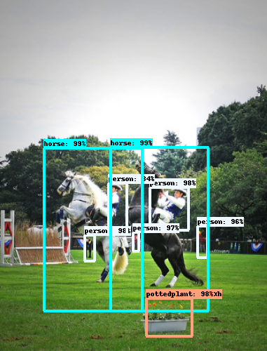
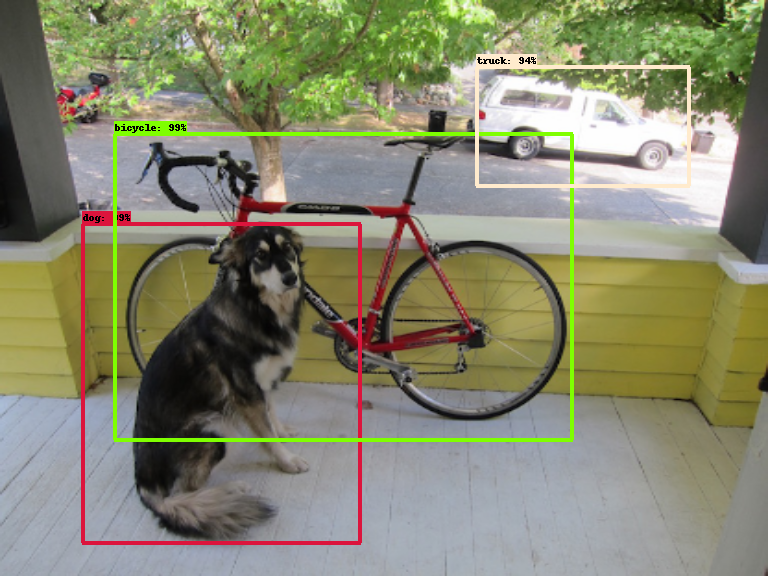
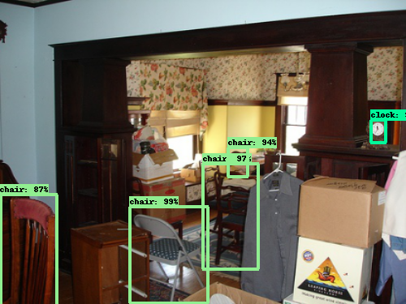
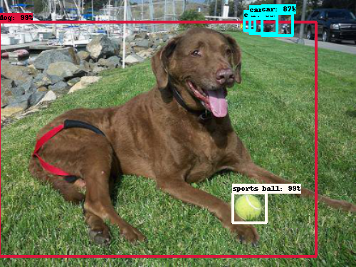
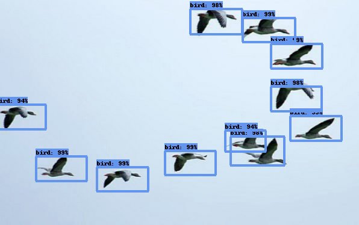
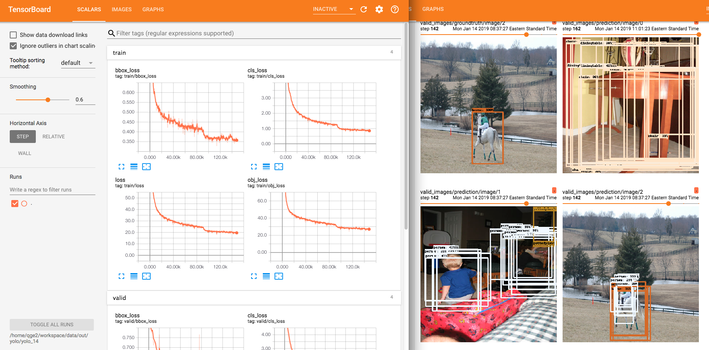
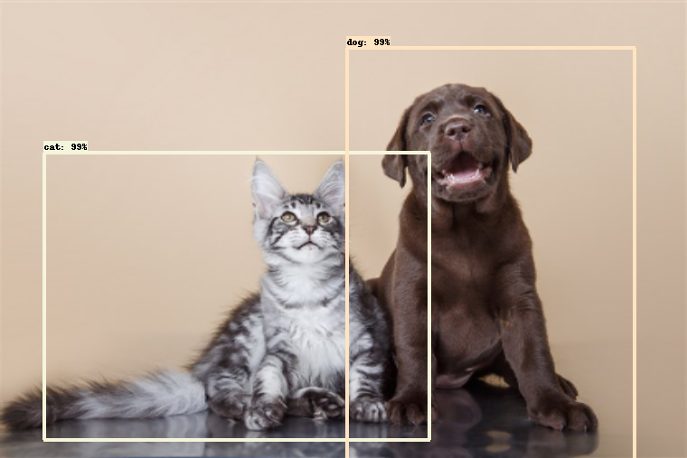
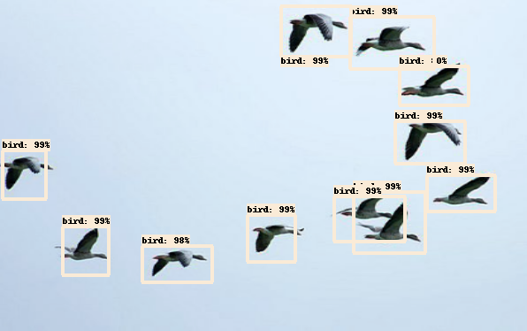

# YOLOv3 for Object Detection

- TensorFlow implementation of [YOLOv3](https://arxiv.org/abs/1804.02767) for object detection.
- Both [inference](https://github.com/conan7882/YOLOv3/tree/master#use-pre-trained-model-for-object-detection-80-classes) and [training](https://github.com/conan7882/YOLOv3/tree/master#train-on-voc2012-dataset-20-classes) pipelines are implemented.
- For inference using pre-trained model, the model stored in `.weights` file is first downloaded from official [YOLO website](https://pjreddie.com/darknet/yolo/) (Section 'Performance on the COCO Dataset', YOLOv3-416 [link](https://pjreddie.com/media/files/yolov3.weights)), then [converted](docs/convert.md) to `.npy` file and finally loaded by the TensorFlow model for prediction.
- For training, the pre-trained DarkNet-53 is used as the feature extractor and the YOLO prediction layers at three scales are trained from scratch. Data augmentation such as random flipping, cropping, resize, affine transformation and color change (hue, saturation, brightness) are applied. Anchor clustering and multiple scale training (rescale training images every 10 epochs) are implemented as well.


## TODO

- [x] Convert pre-trained `.weights` model to `.npy` file ([detail](docs/convert.md)).
- [x] Pre-trained DarkNet-53 for image classification ([detail](docs/darknet.md)).
- [x] Object detection using pre-trained YOLOv3 trained on [COCO](http://cocodataset.org/#home) dataset ([detail](https://github.com/conan7882/YOLOv3/tree/master#use-pre-trained-model-for-object-detection-80-classes)).
- [x] YOLOv3 training pipeline
- [x] Train on VOC dataset ([detail](https://github.com/conan7882/YOLOv3/tree/master#train-on-voc2012-dataset-20-classes)).
- [ ] Performance evaluation.
- [ ] Train on custom dataset.

## Requirements
- Python 3.0
- TensorFlow 1.12.0+
- Numpy
- Scipy
- imageio
- Matplotlib

<!--## Implementation details
### Inference
- 
-->
## Use pre-trained model for object detection (80 classes)
### Download pre-trained model
- Download the pre-trained model `yolov3.npy` from [here](https://www.dropbox.com/s/ovqhk1vahe3dd8z/yolov3.npy?dl=0). This model is converted from the `.weights` from [here](https://pjreddie.com/darknet/yolo/) (Section 'Performance on the COCO Dataset', YOLOv3-416 [link](https://pjreddie.com/media/files/yolov3.weights)).
- More details for converting models can be found [here](docs/convert.md).

### Setup configuration
- Modified the config file `configs/config_path.cfg` with the following content: 

  	```
  	[path]
	coco_pretrained_npy = DIRECTORY/TO/MODEL/yolov3.npy
	save_path = DIRECTORY/TO/SAVE/RESULT/
	test_image_path = DIRECTORY/OF/TEST/IMAGE/
	test_image_name = .jpg
  	```
  	
	- Put the converted pretrained model `yolov3.npy` in `coco_pretrained_npy`.
	- Put testing images in `test_image_path`.
	- Part of testimg image names is specified by `test_image_name`.
	- Result images will be saved in `save_path`.
	
- Use `obj_score_thresh` and `nms_iou_thresh` in config file `configs/coco80.cfg` to setup the parameters of non-maximum suppression to remove multiple bounding boxes for one detected object. 
  - `obj_score_thresh` is the threshold for deciding if a bounding box detects an object class based on the score. Default is `0.8`.
  - `nms_iou_thresh` is the threshold for deciding if two bounding boxes overlap too much based on the IoU. Default is `0.45`.
  
	
### Prediction
- Put testing images in `test_image_path` in `pretrain_coco_path.cfg` and go to `experiment\`, run

  ```
  python yolov3.py --detect
  ```
  
- Testing images are rescaled to 416 * 416 fed into the network. 
- Result images are saved in `save_path` setting in `configs/pretrain_coco_path.cfg`.

### Sample results


<!---->



## Train on [VOC2012](http://host.robots.ox.ac.uk/pascal/VOC/voc2012/) dataset (20 classes)
### Prepare dataset and pre-trained feature extractor
- Download VOC2012 training/validation data from [here](http://host.robots.ox.ac.uk/pascal/VOC/voc2012/VOCtrainval_11-May-2012.tar) (2GB tar file).
- Download the pre-trained Darknet-53 `yolov3_feat.npy` from [here](https://www.dropbox.com/s/yr99vxxzrt832ro/yolov3_feat.npy?dl=0). This model is converted from the `.weights` from [here](https://pjreddie.com/darknet/imagenet/) (Section 'Pre-Trained Models', Darknet53 448x448 [link](https://pjreddie.com/media/files/darknet53_448.weights)).
- More details for converting models can be found [here](docs/convert.md).

### Setup configuration
- Modified the config file `configs/config_path.cfg` with the following content: 

  	```
  	[path]
	yolo_feat_pretraind_npy = DIRECTORY/TO/MODEL/yolov3_feat.npy
	train_data_path = DIRECTORY/OF/TRAINING/SET/
	save_path = DIRECTORY/TO/SAVE/RESULT/
  	```
  	
	- Put the converted pretrained model `yolov3_feat.npy` in `yolo_feat_pretraind_npy`.
	- `train_data_path` is the parent directory `JPEGImages` and `Annotations` for training/validation set.
	- Tensorboard summary and trained model will be saved in `save_path`.
	
- Use config file `configs/voc.cfg` to setup the hyper-parameters for training on VOC2012. Default values are the current setting. `anchor` are the 9 anchors (width and height) obtained from anchor **clustering** in ascending order. `obj_weight` and `nobj_weight` are the weights of object loss and non-object loss. `multiscale` is the set of scales used for training.

### Training
- Go to `experiment\`, run

  ```
  python yolov3.py --train
  ```
- The entire dataset is randomly divided into 14556 training samples (85%) and 2568 validation images (15%).
- Data augmentation (flipping, cropping, resize, affine transformation and color change) is applied to the training set. The training images are rescaled every 10 epochs (randomly picked from `multiscale` in `configs/voc.cfg`).
- Validation image are all rescaled to 416 * 416 without augmentation for validation.
- The learning rate schedule needs to be further tuned, but the current setting is: 0.1 (1-50 epochs), 0.01 (51-100 epochs) and 0.001 (101-150 epochs).
- Tensorboard summary includes losses and sample predictions for both training set (every 100 steps) and validation set (every epoch) are saved in `save_path` in `configs/config_path.cfg`. Note that non-maximum suppression does not used in sample predictions and only top 20 predicted bounding boxes based on class score are shown. You can see how the model is doing during training: 
  

### Sample results
- Prediction after 150 epochs. Performance evaluation will be added soon.




### Reference code

- https://github.com/pjreddie/darknet
- https://github.com/experiencor/keras-yolo3
- https://github.com/qqwweee/keras-yolo3
   
## Author
Qian Ge
